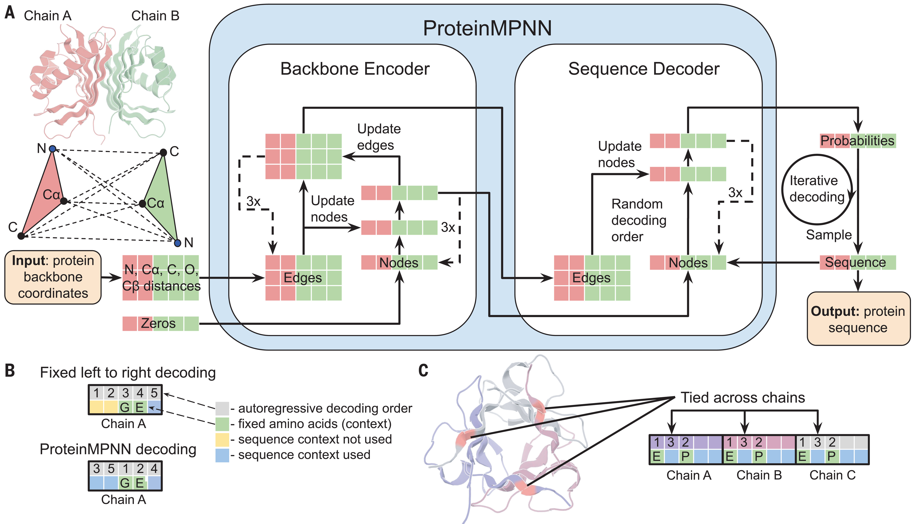

# ProteinMPNN
Walkthrough &amp; scripts to perform ProteinMPNN on Bristol HPC's BC4 

Instructions originally compiled by Holly Ford (h.ford@bristol.ac.uk)

# What is ProteinMPNN?
A robust message-passing neural network, which diverisfies the primary sequence of the input PDB file, whilst aiming to retain secondary and tertiary structures. It can do this freely, choosing the best residues it believes for each position (lowest perplexity) and or by following your bias files, if you need certain areas charged/hydrophobic/polar etc.. Newer LigandMPNN is now available, but this module is already installed on BC4 and does not require a github cloned for operation, so might be the simpler choice. 


*ProteinMPNN architecture.* Image from  

# What do I need to start?
All you need is a decent PDB starting structure. This model has no ligand context, so it has to be an apo structure, with chain information. If your pdb doesn't have chain information, add it in PyMOL easily:
  1. Viewing > Selecting:Chain
  2. Select protein chain
  3. alter sele, chain='A'
  4. Save as PDB

This model doesn't have context for any form of non-natural amino acids, so if your starting structure is out of an MD run whereby the reisdues may have had a jazzy new name provided by a parameter file, make sure to change back to standard nomenclature. This can be done through a text editor (VIM, Opening file as text editor on WinSCP) or through sed commands. 

# Getting Started
ProteinMPNN is ran utilising a range of python scripts, which are provided in this repository, but are also available in BC4 storage at:

* /mnt/storage/software/apps/ProteinMPNN/helper_scripts/ 
* ^ {script_path} for future ease

So either copy to your local area or provide their path in your submission scripts (like I have done in the example). The scripts in question are parse_multiple_chains.py, assign_fixed_chains.py, make_fixed_positions_dict.py, protein_mpnn_run.py and a couple others if you need a bias file (more on that below). Next, you'll need to ready your terminal by loading the modules and environments needed: 
```
module load apps/proteinmpnn
source activate mlfold 
```
# Preparing .json and bias files 
Now its time to convert your .pdb input into a .json file. Easiest way to run this is to put your input pdb into a directory called "inputs" (with no other PDBs present) and have another directory ready called "outputs". Then run:
```
python {script_path}/parse_multiple_chains.py --input_path inputs/ --output_path outputs/{file_name_to_match_that_of_pdb}.json
```
Bias files allow ypu to have a perference of specific residues for each position on your primary sequence. For example, I have used these bias files to bias the solvent exposed areas of my protein design to hydrophobics instead, and created sequences which are predicted to be membrane-bound. An email we recieved from the Baker group indicated that a bias 0.2 to 0.6 is a *gentle positive* nudge whereas 1.0 to 3.0 is a *reasonable positive* push. It's the same rationale for negative biasing (e.g. -0.2 to -0.6 is a *gentle negative* bias). To create a bias, you need to create a .txt file preferably called {file_name_to_match_that_of_pdb}_bias.txt, mostly for your own clarity. This file should be in the format (example .txt file above too):
```
select idx 14,21,24,31,34,35,42,49,61,64,65,72,78,79,81,82,88,89,93,95,99,100,106,107 res AQERK:2; 
select idx 25,26,27,28,29,52,53,54,55,56,57,58,59,83,84,85,86,87 res AQERKGSTPD:2 
```
Whereby the *idx* are the residue loci, the *res* are the residues being biased, and the *number* after the colon indicates the bias strength and in which direction. There isn't a limit to the bias. The script create_mpnn_bias.py needs to be copied from the repositroy to a known location as its not in the storage area.  Create your biased json file by running:
* python {script_path}/create_mpnn_bias.py -j outputs/{file_name_to_match_that_of_pdb}.json -b ./{file_name_to_match_that_of_pdb}_bias.txt -o outputs/{file_name_to_match_that_of_pdb}_bias.json

# Prepping & Running your submission script
If you take a look at the example submission script, you can see this runs on CPUs and will run very quick (depending on input size and the number of outputs wanted). There aren't many things you'll need to change besides the following:
* chains_to_design="A" - ensure your input pdb has chain information and it is correct. It's possible to run multimers (maybe include info below)
* AA_list = "HC" - this is the list of omitted amino acids, for example, I want to avoid histidines to avoid off-target ligand binding, and avoid cysteines to prevent dimerisation upon expression
* fixed_positions= "15 19 26" - list of positions you want to keep the same
* bias_by_res_jsonl {file_name_to_match_that_of_pdb}_bias.json - your bias files, hash out line if not necessary
* num_seq_per_target - how many outputs you'd like
* sampling_temp - increasing temperature increases variability of sampling at each design positions

Run this script with your account code with at least 10GB memory available.

# Analysing outputs 
The output of your run will be a fasta file (.fa) with a scoring function in the sample name. The score is a proteinmpnn-version of perplexity, with *low* scores indciating that the algorithm has *fewer* alternative options to that amino acid, hence it is *more confident*. TLDR: lower the score, the better the sequence. The entire fasta file can now be fed into a structure prediction algorithm, just fix the file format with the sed command below to remove any spaces or unwanted characters:
```
sed -e 's/\//:/g' -e 's/[^A-Za-z0-9._>:-]/_/g' -e 's/\./-/g'
```
