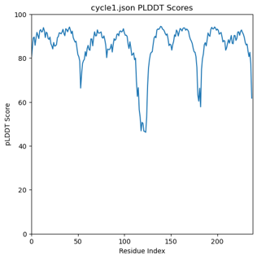
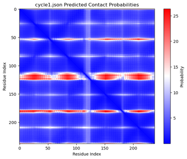

# PAE and pLDDT Plotting 
Copy the contents of the python script into a cell of a Jupyter notebook. To run, have some version of conda/miniconda loaded. The script works by going into the directory listed (e.g. the directory of ESMFold outputs) and plotting the contents of the present .json scripts. 

Example of a pLDDT plot (left) with a per-residue score of confidence (higher the better), and PAE (right). For PAE, the lower the probability (and hence the bluer) the pairwise alignment, the more confident the prediction. 
